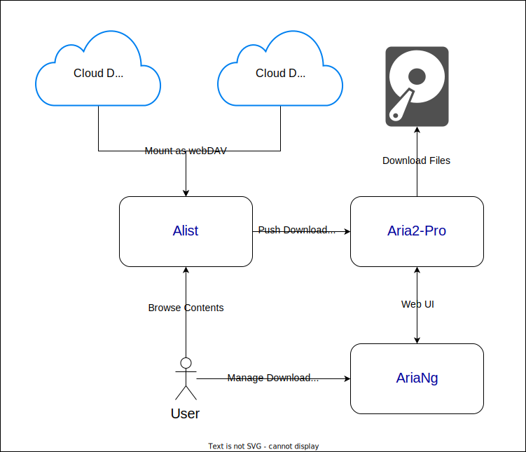

# Docker Compose Alist + Aria2-Pro

This is a `docker compose` setup guide for deploying [Alist](https://alist-doc.nn.ci/en/)
and [Aria2-Pro](https://github.com/P3TERX/Aria2-Pro-Docker). The combination of these two apps is a good solution to
mounting cloud drives and downloading files.

With the help of Docker Compose, you can deploy and set up these apps in just a few minutes.

## Before You Start

- You should have [Docker Desktop](https://docs.docker.com/desktop/)
  or [Docker Engine](https://docs.docker.com/engine/install/) installed on your machine.
- Since we're going to deploy these apps via [Docker Compose](https://docs.docker.com/compose/), the `compose` plugin
  should also be enabled.
- `Docker Desktop` is for Windows, macOS and Linux desktops, and `Docker Engine` is for Linux servers.

## Deploy Containers with Docker Compose

1. Clone this repository to where you want to deploy the apps on your machine. All files will be stored
   in [current working directory](https://linuxize.com/post/current-working-directory/), aka `${PWD}`, by default. If
   you wish to modify storages, you can do so by modifying the [volumes](https://docs.docker.com/storage/volumes/)
   section in the [docker-compose.yml](./docker-compose.yml#L34) file.
2. Set a `RPC_SECRET` for `Aria2-Pro` in [docker-compose.yml](./docker-compose.yml#L24) file.
3. Run `docker compose up -d` or `docker-compose up -d` within the repository to deploy
   the [containers](https://www.docker.com/resources/what-container/).

🥳 Congrats! You have just deployed the containers.

## Visit The Apps with Your Docker Machine's IP Address in Browser

To avoid some network issue, it is recommended to visit all apps using the docker machine's IP address, instead
of `localhost` or `127.0.0.1`.

For example, the IP address of my machine is `192.168.1.20`, I'll just visit Alist using `http://192.168.1.20:5244/`.

You can check your IP address by running `ifconfig` or `ipconfig` in your terminal.

| APP       |                       URL |
|:----------|--------------------------:|
| Alist     | http://${IP_ADDRESS}:5244 |
| Aria2 RPC | http://${IP_ADDRESS}:6800 |
| AriaNg    | http://${IP_ADDRESS}:6880 |

## Setup Alist

To manage `Alist`, you must first obtain the default password generated at startup by running this
command: `docker exec -it alist ./alist -password`.

Now you can visit Alist in your browser: `http://${IP_ADDRESS}:5244/`.

## Connect Aria2-Pro

In `Alist`'s `Settings` area, please open `Backend` tab to configure the Aria2's RPC access.

- Find `Aria2 RPC url`, set it to `http://${IP_ADDRESS}:6800/jsonrpc`.
- Find `Aria2 RPC secret`, set it to the `RPC_SECRET` you have configured
  in [docker-compose.yml](./docker-compose.yml#L24).

## Mount Cloud Drives

You can mount your Cloud Drives in `Alist`'s `Accounts` area.

## Manage Download Tasks In AriaNg

1. Open `RPC` tab in `http://${IP_ADDRESS}:6880/#!/settings/ariang`.
2. Set your `RPC_SECRET` in the `Aria2 RPC Secret` field.
3. Click `Reload` button on popup, and you're good to go.

